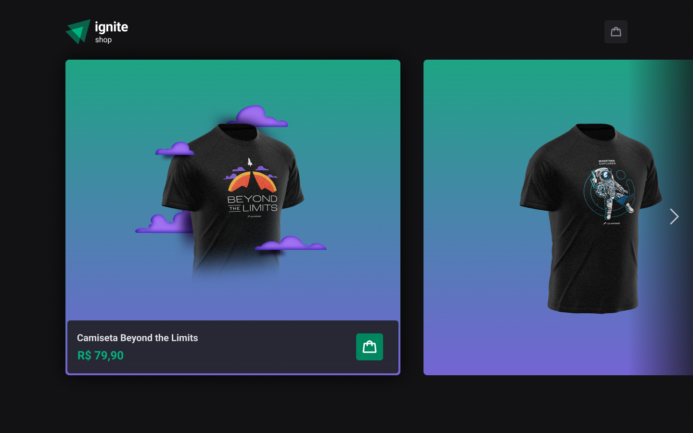
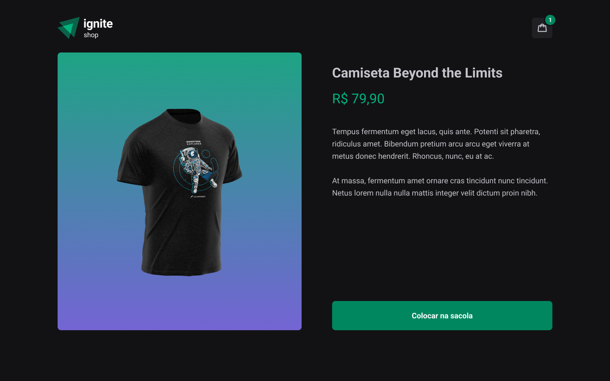

<div align="center">
  
</div>

## 📝 O que é o Ignite Shop?

O Ignite Shop é um projeto desenvolvido durante o Ignite da Rocketseat, um programa de aceleração para devs. O projeto consiste em um e-commerce de camisetas, onde é possível adicionar produtos ao carrinho, visualizar o total de itens e o valor total da compra, além de poder finalizar a compra e visualizar o pedido.
Fazendo isso através de uma conexão com o Stripe, que é uma plataforma de pagamentos online.

## 📷 Demonstração

<div align="center">
  
  
</div>

## 🚀 Tecnologias

✔️ [React](https://reactjs.org/) - Uma biblioteca JavaScript para criar interfaces de usuário.<br/>
✔️ [TypeScript](https://www.typescriptlang.org/) - TypeScript é um superconjunto de JavaScript desenvolvido pela Microsoft que adiciona tipagem e alguns outros recursos a linguagem.<br/>
✔️ [Next.js](https://nextjs.org/) - O Next.js é um framework React que permite funcionalidades como renderização do lado do servidor e geração de sites estáticos para aplicativos da web baseados em React.<br/>
✔️ [Stitches](https://stitches.dev/) - Stitches é uma biblioteca de estilização CSS-in-JS que permite que você escreva estilos com uma sintaxe simples e elegante.<br/>
✔️ [Stripe](https://stripe.com/br) - Stripe é uma plataforma de pagamentos online.<br/>
✔️ [Context API](https://pt-br.reactjs.org/docs/context.html) - Context fornece uma maneira de passar dados através da árvore de componentes sem ter que passar props manualmente em cada nível.<br/>
✔️ [React Hook Form](https://react-hook-form.com/) - Uma biblioteca para lidar com formulários de maneira fácil e rápida.<br/>
✔️ [Zod](https://zod.dev/) - Biblioteca para validação de dados e construção de esquemas em TypeScript.<br/>
✔️ [Axios](https://axios-http.com/docs/interceptors) - Biblioteca para fazer requisições HTTP.<br/>

## 📁 Como baixar o projeto

```bash
# Clonar o repositório
$ git clone

# Entrar no diretório
$ cd ignite-shop

# Instalar as dependências
$ yarn

# Iniciar o projeto
$ yarn dev

# O projeto estará disponível em http://localhost:3000
```

## 🖊️ Autor

- [@raniellimontagna](https://www.github.com/raniellimontagna)
